# 2019-8-14-Blockchain-MVP

# Event URL: [https://bit.ly/2Z0xqFh](https://bit.ly/2Z0xqFh)

# An introduction to the IBM Blockchain Platform 2.0!

# Contacts: Linkedin.com/in/lennartfrantzell/

# In the Beginning.

It all started in October during the Global Financial Crisis in 2008 with Satoshi Nakamoto and his paper [BitCoin: A Peer-to-Peer Electronic Cash System](https://bitcoin.org/bitcoin.pdf) which addressed a key problem in electronic commerce:

<i><b>
A purely peer-to-peer version of electronic cash would allow online payments to be sent directly from one party to another without going through a financial institution. 

 
Digital signatures provide part of the solution, but the main benefits are lost if a trusted third party is still required to prevent double-spending. 

We propose a solution to the double-spending problem using a peer-to-peer network.</i></b> 

On 3 January 2009, the bitcoin network came into existence with Satoshi Nakamoto mining the genesis block of bitcoin (block number 0), which had a reward of 50 bitcoins.

https://www.linkedin.com/pulse/labor-day-tribute-bitcoin-other-cryptos-jesse-lund/

Since then Bitcoin and Blockchain have inhabited two seperate worlds (Financial Use Cases vs non-financial Use Cases such as Supply Chain etc) 

Until now...
 
# Important Use Case: cross-border multi-currency payments and remittances! 
 
## IBM Blockchain World Wire:  
Built on the Stellar Protocol
[IBM World Wire](https://www.ibm.com/blockchain/solutions/world-wire)

Introducing IBM Blockchain World Wire, the new financial rail that simultaneously clears and settles cross-border payments in near real-time. Integrating with your existing payment systems, you’ll replace costly opacity with affordable transparency – and that can bring greater financial opportunity to all.

### IBM is taking its banking clients a step closer to cryptocurrency.

March 18, 2019

Announced Monday, six international banks have signed letters of intent to issue stablecoins, or tokens backed by fiat currency, on World Wire, <b>an IBM payment network that uses the Stellar public blockchain.</b> The network promises to let regulated institutions move value across borders – remittances or foreign exchange – more quickly and cheaply than the legacy correspondent banking system.

......

Aside from issuing their own tokens, the arrangement opens up the possibility of banks using lumens, the native token of the Stellar blockchain, which can be used as a “bridge currency” when it is hard to trade one type of fiat for another. Also, World Wire “could support other cryptos” but is only supporting lumens for the moment because financial institutions are put off by the volatility of cryptocurrencies, Lund said....

https://www.coindesk.com/ibm-signs-6-banks-to-issue-stablecoins-and-use-stellars-xlm-cryptocurrency
 
 
 ## Ripple cross-border payments.
 https://www.ripple.com
 
## JPMorgan to Start Customer Trials of Its ‘JPM Coin’ Crypto   
   
 First revealed in February, JPM Coin initially runs on top of Quorum, a private version of ethereum developed by the bank.

JPM Coin will function as a stablecoin, with fiat cash being deposited at the bank in exchange for the token, which can then be transferred via a permissioned distributed ledger. The recipient can later redeem the token for cash from JPMorgan.

Initially linked to the U.S. dollar, the coin is expected to be extended to other fiat currencies in time. 
https://www.coindesk.com/jpmorgan-to-start-customer-trials-of-its-jpm-coin-crypto   
   
## Consumer Space: Facebook Libra: 
[Libra White Paper](https://libra.org/en-US/white-paper/)

## Hyperledger FabToken:
https://hyperledger-fabric.readthedocs.io/en/latest/token/FabToken.html
Representing assets as tokens allows you to use the blockchain ledger to establish the unique state and ownership of an item, and transfer ownership using a consensus mechanism that is trusted by multiple parties. As long as the ledger is secure, the asset is immutable and cannot be transferred without the owners consent.

Tokens can represent tangible assets, such as goods moving through a supply chain or a financial instrument being traded. Tokens can also represent intangible assets such as loyalty points. Because tokens cannot be transferred without the consent of the owner, and transactions are validated on a distributed ledger, representing assets as tokens allows you to reduce the risk and difficulty of transferring assets across multiple parties.  

Hiding in section 5.1 is a most important paragraph in the recent Hyperledger Fabric paper. This describes FABCOIN now renamed to FABTOKEN which is a UTXO (Unspent Transaction Output) Token for Fabric. This little thing has 3 huge implications:-

https://www.linkedin.com/pulse/token-hyperledger-fabric-andy-martin/

## Non-Blockchain consumer alternatives: Venmo and Swedish Swish.

# Let's get started: Sources

<a href="https://hyperledger-fabric.readthedocs.io/en/release-1.4/">Hyperledger Fabric Read the Docs</a>

<a href="https://hyperledger-fabric.readthedocs.io/en/release-1.4/key_concepts.html">Key Concepts</a>

<a href="https://github.com/hyperledger/fabric">Hyperledger Fabric source code on GitHub</a>

# I) Learning Objectives:

What we will be doing:

## 1. Sign up to a free IBM Cloud account
 
 Why will we sign up to a free IBM Cloud account?
 Because IBM Blockchain Platform runs in the IBM cloud.
 
<a href="https://ibm.biz/BdzyZr">ibm.biz/BdzyZrp</a> 
 
<a href="https://ibm.biz/BdzyZr">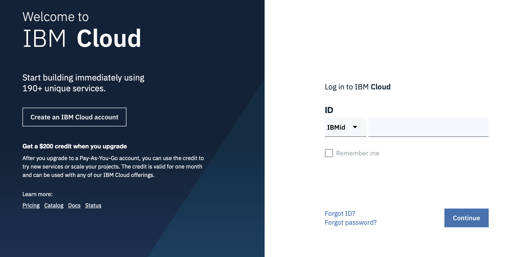</a>
 
## 2. Install Visual Studio Code

[Please Note: Complete instructions: Install IBM Blockchain Platform VS Code extension for free](http://cloud.ibm.com/docs/services/blockchain?topic=blockchain-develop-vscode#develop-vscode-install)

[Click on link to install Visual Studio Code](https://code.visualstudio.com)

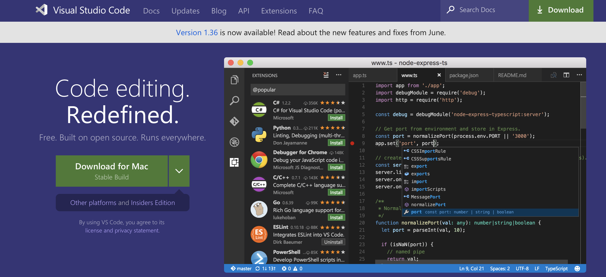

Why will we install Visual Studio Code?
Because it comes with a Plugin-in for the IBM Blockchain Platform, which makes it easy to create Smart Contracts.

## 3. Install IBM Blockchain Platform Plugin in Visual Studio Code

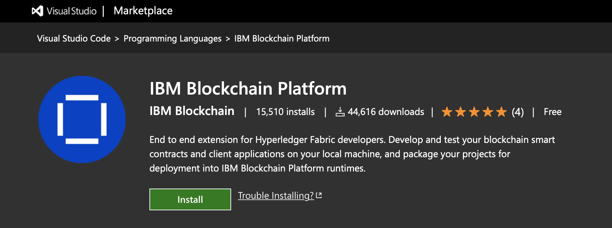

[Click on link to install IBM Blockchain Platform Plugin in Visual Studio Code](https://marketplace.visualstudio.com/items?itemName=IBMBlockchain.ibm-blockchain-platform) 
 
### Please Note: Install issues documented at: https://github.com/IBM-Blockchain/blockchain-vscode-extension/issues/
 

## Prelude to Smart Contract Development

### Start with: <a href="https://www.ibm.com/blockchain/use-cases/">Blockchain Use Cases</a>
      
### Domain knowledge: Existing architecture, systems, domain knowledge and data, regulations
  
### Move selected Off-chain data to On-Chain

### Smart Contracts
   
### Recruit your dev team ( Architect, Domain expert, marketing expert, Operators, Devs)
     
### Consensus algorithm/ Ordering service: Solo, Kafka, Raft 
### MSP, ORGS, Peers, Channels, Ledger, World State Database
 
 
 # II) Developing Smart Contracts in VSCode
 
 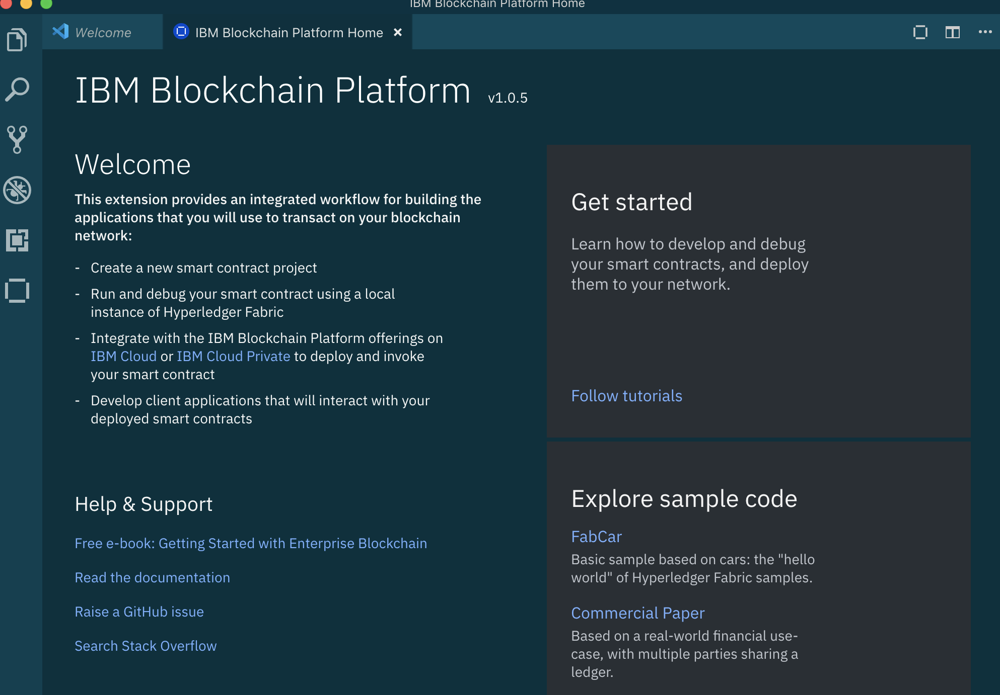

Click on Follow Tutorials above

 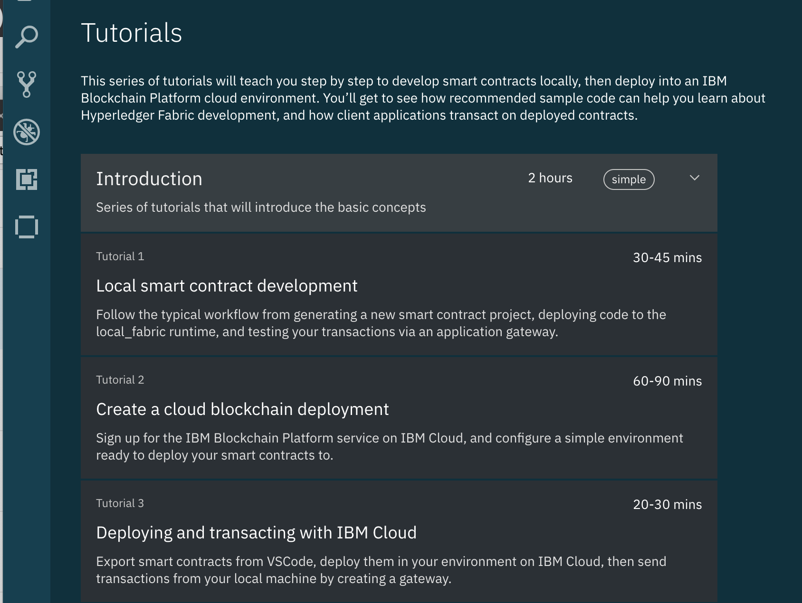
 

Click on Tutorial 1 above

 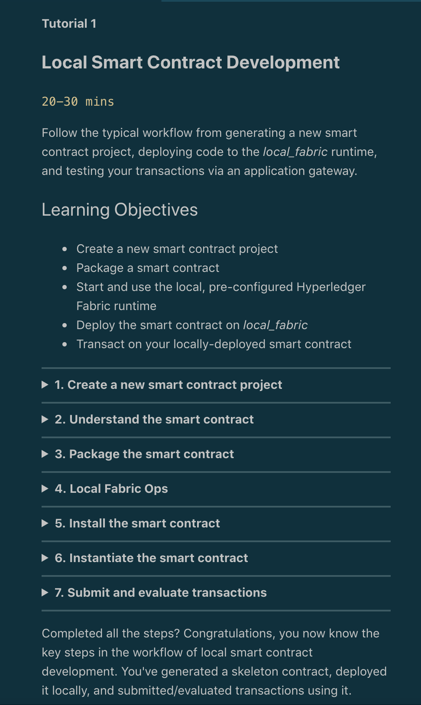
 

  Follow the content in the tutorial
  
  
# III) Smart Contract overview 
 
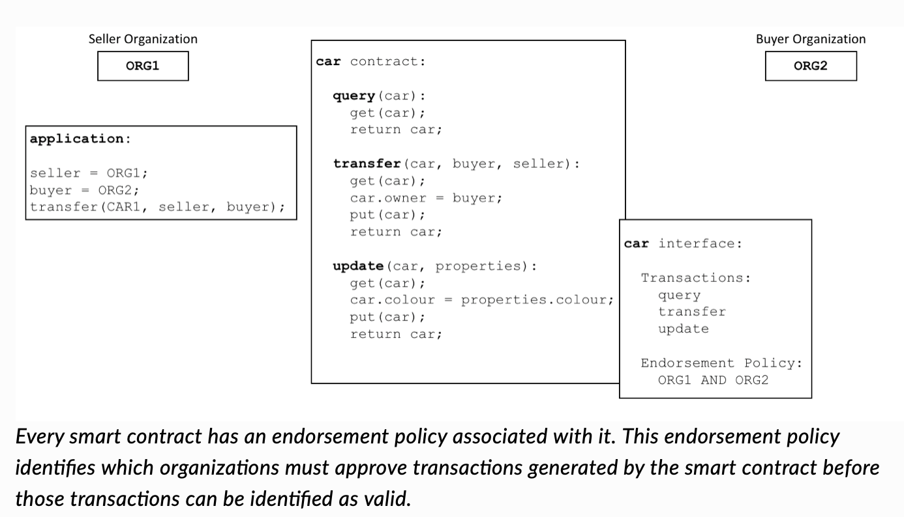
 
 ---------------------------
 
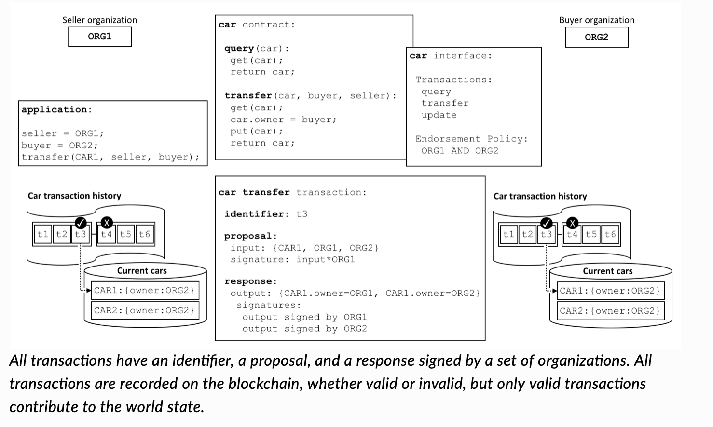

----------------------------

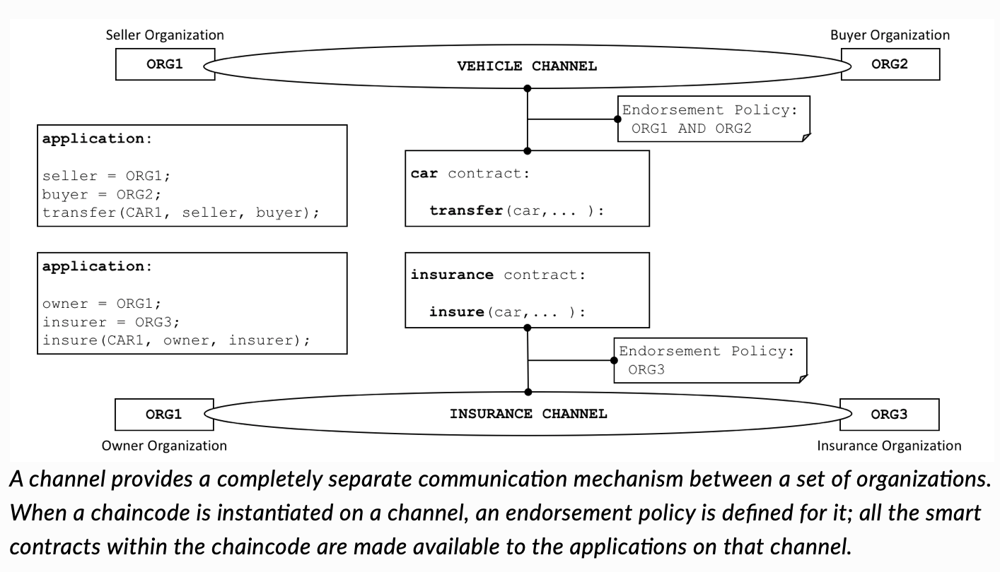

----------------------------

 <a href="https://hyperledger-fabric.readthedocs.io/en/release-1.4/smartcontract/smartcontract.html ">Smart Contracts, see charts above</a>  
 
 <a href="https://developer.ibm.com/patterns/category/blockchain/">IBM Blockchain Code Patterns</a>

 
# IV) IBM Blockchain Platform in the IBM Cloud

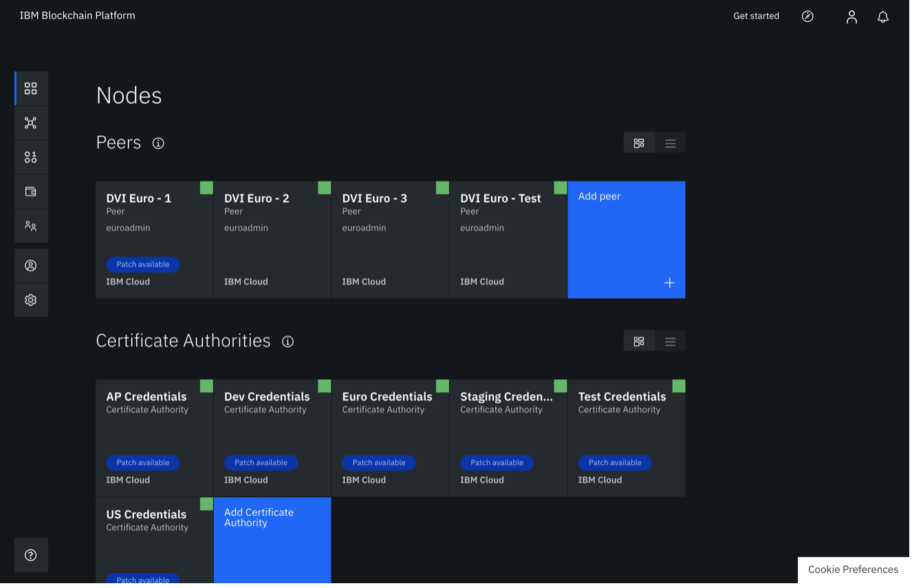

Certificate Authority

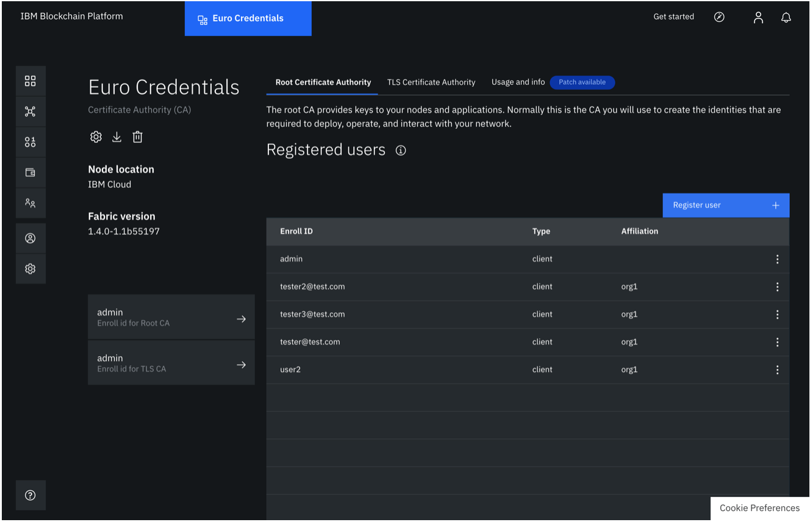

Channel

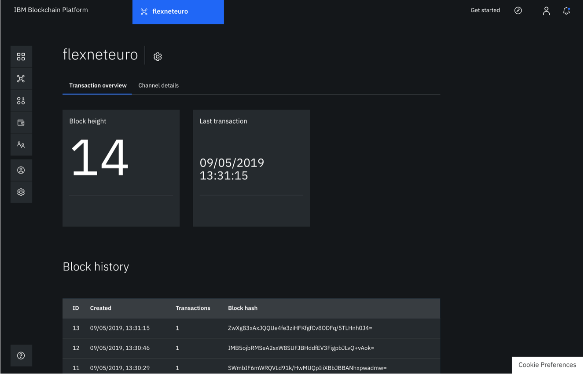

Transaction

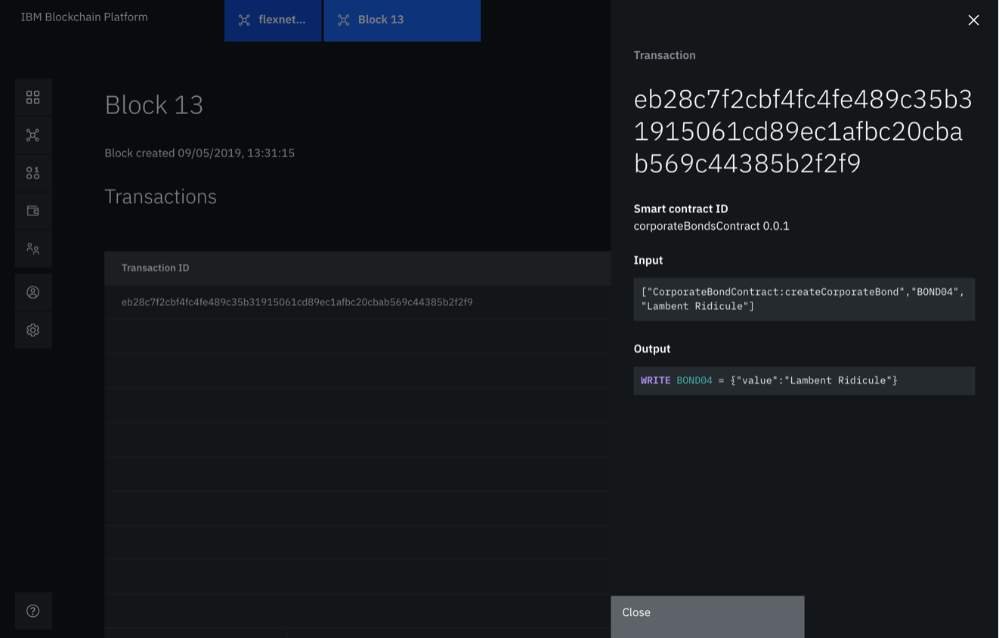
 
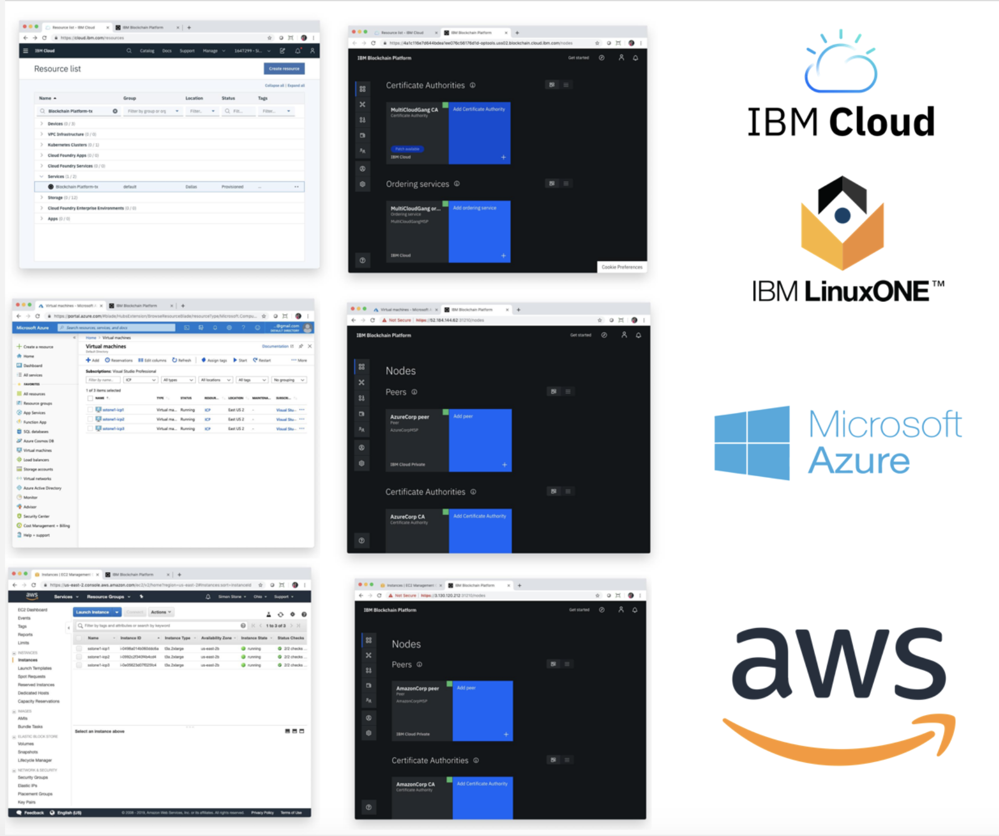
 
 
[Whitelisting](https://cloud.ibm.com/registration/whitelist)

[Whitelisting](https://cloud.ibm.com/registration/whitelist)
